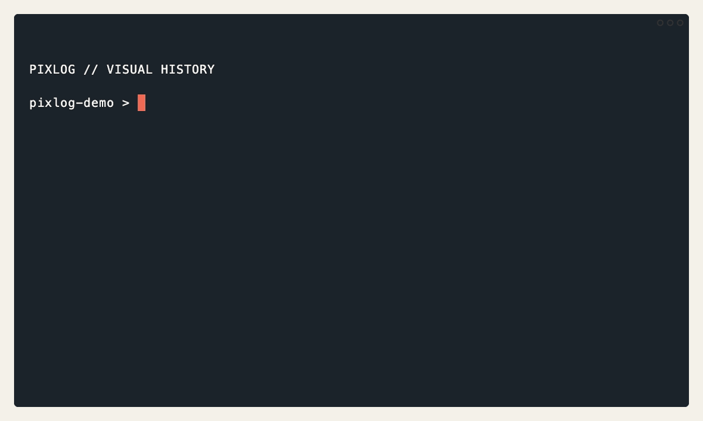

<p align="center">
	
</p>

# PixLog

[English](README.md) | **简体中文**

**面向 Git 图片资产的视觉差异与生成溯源。** Git 告诉你图片变了；PixLog 告诉你
哪些像素变了、由谁修改，以及这张图片是如何生成的。

<p align="center">
	<a href="https://github.com/zhao-xuan/PixLog/actions/workflows/ci.yml"></a>
	<a href="https://github.com/zhao-xuan/PixLog/releases/latest"></a>
	
</p>

<p align="center">
   
</p>

```bash
brew install zhao-xuan/tap/pixlog
pixlog init
pixlog diff --staged
```

PixLog 是面向图像资产的 Git 兼容媒体与溯源层。Git 负责索引、提交、分支、合并
和远程仓库；PixLog 增加：

1. **精确文件历史**：通过 SHA-256 内容寻址媒体对象保存原始字节。
2. **视觉历史**：提供像素指标、变化区域、热力图和视觉 blame。
3. **生成历史**：通过配方、本地溯源 journal 和受保护的复现记录生成过程。

Git 提交小型 PixLog pointer，工作树中仍是原始图像字节。PixLog 不创建第二套提交
图或暂存区。

## 构建

PixLog 需要 Go 1.24 和 Git。终端内联图片预览还需要 Chafa 运行时依赖。

使用 Homebrew 安装：

```bash
brew install zhao-xuan/tap/pixlog chafa
```

可以从[最新版本](https://github.com/zhao-xuan/PixLog/releases/latest)下载 Linux、
macOS 或 Windows 预编译包。每个压缩包都包含 `pixlog` 和 `git-pixlog`，并提供相邻
的 SHA-256 校验文件。直接下载的压缩包还包含 `install-dependencies.sh` 和
`install-dependencies.ps1`，用于安装 Chafa。

从源码构建：

```bash
make build
./bin/pixlog version
```

将两个命令入口安装到 `GOBIN`：

```bash
go install ./cmd/pixlog ./cmd/git-pixlog
```

当 `git-pixlog` 位于 `PATH` 中时，`git pixlog diff` 等价于 `pixlog diff`。

## 快速开始

```bash
git init artwork
cd artwork
pixlog init

# 提交共享的跟踪策略；驱动配置和媒体对象保留在 .git/ 中。
git add .gitattributes .pixlog.toml
git commit -m "Configure PixLog"

# 直接使用 Git 时也会调用 PixLog clean filter。
git add assets/hero.png
pixlog diff --staged
git commit -m "Add hero artwork"
git push
```

Git 索引和提交中保存规范化文本 pointer。clean filter 将原始 blob 和 manifest 保存
到 `.git/pixlog/objects`；checkout 调用 smudge filter，逐字节恢复图像。

`pixlog add`、`commit`、`push`、`pull`、`branch`、`rebase` 等 Git 所有的命令
都会进入同一个 Git 操作。`pixlog git <任意命令>` 是显式 Git 逃生入口。

## 跟踪规则

安装默认跟踪常见 PNG、JPEG、GIF、WebP、AVIF、HEIC、TIFF 和 PSD 模式。可以
添加项目专属模式，重新安装时不会丢失：

```bash
pixlog track 'art/**/*.kra' 'renders/*.bmp'
pixlog install
```

随后提交更新后的 `.gitattributes`。

## 视觉差异

```bash
# 索引到工作树、HEAD 到索引，或两个 Git revision：
pixlog diff
pixlog diff --staged
pixlog diff HEAD~1 HEAD -- assets/hero.png

# 直接比较与热力图：
pixlog compare old.png new.png
pixlog diff --heatmap hero-heatmap.png -- assets/hero.png

# 已安装的 Git 集成：
git diff -- assets/hero.png
git difftool --tool=pixlog HEAD~1 HEAD -- assets/hero.png
```

在交互式终端中，`diff`、`compare`、Git external diff 和 `inspect` 会通过 Chafa
内联显示源图与热力图。使用 `--no-preview` 关闭，或用 `--preview` 强制要求预览。
JSON 和 NDJSON 输出绝不会混入终端图形。可通过 `PIXLOG_PREVIEW_SIZE`（例如
`40x18`）调整每张预览图的画布大小。自动终端检测不适用时，可将
`PIXLOG_CHAFA_FORMAT` 设为 `symbols`、`sixels`、`kitty` 或 `iterm`。

内置光栅解码目前支持 PNG、JPEG 和 GIF。其他可识别格式仍具有精确字节标识、
manifest、pointer、配方、传输和锁能力，但可能无法进行视觉比较。

merge driver 只会自动组合尺寸相同且变化像素不冲突的 PNG。所有不安全情况都保留
为普通 Git 冲突。

## 生成溯源

```bash
pixlog run -- magick input.png -resize 50% output.png
pixlog recipe show output.png
git commit -m "Generate resized artwork"

# 显式附加规范化配方：
pixlog recipe import output.png examples/recipe.json

# 根据两张图片生成明确标为低可信度的推断配方：
pixlog recipe infer before.png output.png

# 从经过验证的源状态规划或执行捕获命令：
pixlog reproduce --revision HEAD output.png
pixlog reproduce --revision HEAD --execute output.png
```

`pixlog run` 仅在命令成功后暂存输出，并记录源 HEAD/索引状态。命令参数包含敏感
信息时请使用 `--redact-args`。PNG 中存在 ComfyUI 或 AUTOMATIC1111 元数据时会
自动导入。

配方关联记录在 `.git/pixlog/journal.sqlite` 中，因此随后使用普通 `git add` 也会
把溯源引用写入 pointer。

## 应用与 Provider 捕获

PixLog 使用同一个本地捕获协议连接原生插件、显式 API 代理和由用户触发的浏览器
捕获，绝不进行透明 TLS 中间人拦截。先通过 CLI 查看各平台的配置步骤：

```bash
pixlog capture guide
pixlog capture guide photoshop
pixlog capture guide comfyui
pixlog capture guide automatic1111
pixlog capture guide openai
pixlog capture guide firefly
pixlog capture guide browser
```

Photoshop UXP 与浏览器 adapter 使用带 token 的 loopback daemon；API 工具使用
显式代理，并由用户把客户端指向代理地址：

```bash
export PIXLOG_CAPTURE_TOKEN="$(pixlog capture token)"
pixlog capture serve

# 在另一个 shell 中运行，并把 API 客户端改到 7861 端口。
pixlog capture proxy --platform automatic1111 \
	--upstream http://127.0.0.1:7860 --listen 127.0.0.1:7861
```

查看 session 后，将它与输出的精确字节绑定：

```bash
pixlog capture sessions
pixlog capture show <session-id>
pixlog capture finalize <session-id> assets/output.png
```

Photoshop adapter 位于 `adapters/photoshop`，Chromium MV3 adapter 位于
`adapters/browser`。无法使用 Photoshop 原生捕获时，可运行
`pixlog capture history photoshop-history.txt assets/output.psd` 导入详细 History Log。

Provider 请求在进入 CAS 前会脱敏。只有标记为 `exact-request` 的 recipe 可以重放，
并且执行时必须提供新的显式 base URL；当前可选 Bearer 认证只从用户指定的环境变量读取：

```bash
pixlog reproduce --revision HEAD assets/output.png
pixlog reproduce --revision HEAD --execute \
	--base-url https://api.example.test \
	--auth-env PROVIDER_API_TOKEN \
	--response-output response.json \
	assets/output.png
```

PixLog 不会执行 recipe 中捕获的远程 host 或密钥；payload 中只要存在
`[REDACTED]` 就会拒绝执行，而不是猜测缺失值。

## Metadata 与 Content Credentials

PNG 与 JPEG 检查可提取支持的 EXIF、XMP、ICC、IPTC 和 C2PA 信号，并导入为
provenance recipe：

```bash
pixlog metadata inspect assets/output.jpg
pixlog metadata import assets/output.jpg
```

C2PA 验证和签名把密码学与 trust store 处理交给官方外部 `c2patool`：

```bash
pixlog c2pa verify assets/output.jpg
pixlog c2pa import assets/output.jpg
pixlog c2pa export --output manifest.json assets/output.jpg
pixlog c2pa sign --output signed.jpg --manifest manifest.json assets/output.jpg
```

导出只映射公开 action 摘要；私有 prompt 与完整 vendor payload 仍保留在 PixLog
recipe 对象中。

## 媒体远程与 Hydration

pre-push hook 会扫描即将推送的提交，在 Git 更新 refs 前上传其引用的 blob、
manifest、recipe 以及 recipe 递归引用的 CAS 对象。已有用户 pre-push hook 会被
保留并执行。

本地 Git remote 会自动使用相邻的 `.pixlog` 媒体目录。也可以配置显式文件或
HTTP Batch endpoint：

```bash
git config pixlog.remote.origin.endpoint /srv/pixlog/project-media
# 或
git config pixlog.remote.origin.endpoint https://media.example.test/project
```

```bash
pixlog dehydrate assets/hero.png
pixlog hydrate assets/hero.png
pixlog clone /srv/git/artwork.git teammate-copy
```

文件 endpoint 和 HTTP Batch basic transfer 客户端已经实现。S3/Azure 原生适配器
以及选择性或延迟 checkout 仍在规划中。

## 历史、完整性与协作

```bash
pixlog lineage assets/hero.png
pixlog lineage --graph --verify assets/hero.png
pixlog lineage --graph --hydrate --verify assets/hero.png
pixlog blame --point 823,441 assets/hero.png

pixlog verify
pixlog doctor

pixlog lock --remote origin assets/hero.psd
pixlog locks --remote origin
pixlog unlock --remote origin assets/hero.psd
```

lineage 和视觉 blame 会沿 Git 历史跨 rename 跟踪。graph 模式递归发现并验证 recipe
的输入、输出、模型、mask、workflow、vendor payload 和嵌套 recipe；`--hydrate`
从 origin 媒体 endpoint 获取缺失对象。锁支持本地与共享文件 endpoint；HTTP 锁
需要未来的服务端实现。

## 策略与 CI

将 [examples/policy.json](examples/policy.json) 作为 `.pixlog-policy.json` 提交，然后
检查已暂存变更或 Pull Request 范围：

```bash
pixlog check
pixlog check --json
pixlog check --range origin/main...HEAD
```

规则可以限制格式、大小、配方、视觉变化、SSIM、矩形区域和位图 mask。违反策略时
命令以状态码 1 退出。

GitHub Actions 会对每次向 `main` 的 push 和 Pull Request 执行格式检查、测试、
`go vet`，并构建两个命令。成功运行后会保留 Linux、macOS 和 Windows 的可下载
产物七天。

`main` 检查通过后，维护者可以推送语义化版本标签来发布：

```bash
git tag -a v0.1.0 -m "PixLog v0.1.0"
git push origin v0.1.0
```

发布工作流会再次验证仓库，构建 amd64 与 arm64 压缩包，生成 SHA-256 校验文件，
并发布带自动生成说明的 GitHub Release。带后缀的标签（例如 `v0.1.0-rc.1`）会成为
预发布版本。

## 命令范围

| 类别     | 命令                                                                                 |
| -------- | ------------------------------------------------------------------------------------ |
| 初始化   | `init`、`install`、`track`、`git install`                                    |
| 图像状态 | `add`、`status`、`diff`、`compare`、`inspect`                              |
| 溯源     | `recipe import/show/diff/infer`、`run`、`reproduce`、`lineage`、`blame`    |
| 捕获     | `capture serve/status/token/guide/proxy/history/sessions/show/finalize`            |
| Metadata | `metadata inspect/import`、`c2pa verify/import/export/sign`                      |
| 媒体     | `hydrate`、`dehydrate`、`verify`、`doctor`                                   |
| 协作     | `lock`、`unlock`、`locks`、`check`                                           |
| Git 代理 | `commit`、`log`、`show`、`push`、`pull`、`merge`、`rebase` 等 Git 命令 |
| 逃生入口 | `pixlog git <任意 Git 命令>`                                                       |

`pixlog status --porcelain[=v2] -z` 会保留 Git 的机器可读输出。PixLog 原生检查命令
通常支持 `--json`，diff 还支持 NDJSON。

## 项目文档

- [产品规格](docs/PRODUCT_SPEC.md)
- [架构](docs/ARCHITECTURE.md)
- [Git 集成与 Phase 1-5 设计](docs/GIT_INTEGRATION.md)
- [功能进度](docs/FEATURE_PROGRESS.md)
- [配方与溯源格式](docs/RECIPE.md)
- [平台捕获与 adapter 指南](docs/PLATFORM_INTEGRATION.md)
- [参与贡献](CONTRIBUTING.md)
- [安全策略](SECURITY.md)

## 验证

```bash
make check
```
