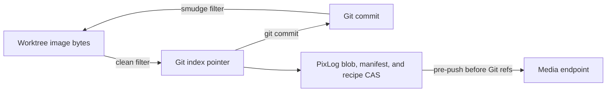

# Architecture

## Design Rule

PixLog separates four identities:

- **Git identity**: the Git blob/tree/commit OID selected by the repository hash
  algorithm.
- **Content identity**: SHA-256 of exact source image bytes.
- **Manifest identity**: SHA-256 of normalized image inspection data.
- **Recipe identity**: SHA-256 of normalized generation/edit JSON.

This prevents false equivalence. JPEG recompression can change nearly every byte
while preserving appearance; metadata can change without changing pixels; similar
images can come from different workflows.

## Single Version-Control Authority

Git owns HEAD, the index, commits, branches, worktree rules, merges, and remotes.
PixLog does not create a second staging area or history. Git commits PixLog pointer
blobs, while PixLog manages the media and provenance objects referenced by them.



Git-owned PixLog commands proxy Git. Image-aware commands read Git's HEAD, index,
worktree, and revisions directly. The legacy standalone repository package remains
for compatibility and future migration tooling, not as the current CLI state
machine.

## Repository Layout

```text
.gitattributes               # tracked filter/diff/merge policy
.pixlog.toml                 # tracked repository-level PixLog policy
.git/
  config                     # local executable commands and media endpoint
  hooks/pre-push             # local preserving dispatcher
  pixlog/
    objects/
      sha256/ab/cdef...      # blob, manifest, and recipe objects
    journal.sqlite           # local content-to-recipe association
    locks/                   # local lock records
```

Only `.gitattributes`, `.pixlog.toml`, and image pointers enter Git. CAS objects,
journal rows, credentials, and machine-specific executable paths remain local.

Legacy raw image blobs and `.pixlog-meta` sidecars are accepted while reading old
snapshots. Current writes do not create sidecars.

## Pointer Contract

A pointer is LFS-compatible canonical text with required image, size, and manifest
references and optional recipe/media/visual fields. It is limited to 1024 bytes.
Large or sensitive provenance stays in recipe objects.

The pointer is the connection between Git's commit graph and PixLog's immutable
object graph:

```text
Git commit
  image path -> pointer
                  blob OID     -> exact image bytes
                  manifest OID -> normalized inspection data
                  recipe OID   -> generation/edit provenance (optional)
```

Perceptual and visual hashes are search/comparison hints. They are never integrity
or security identities.

## Filter Lifecycle

The long-running filter-process v2 server implements clean and smudge.

Clean:

1. Detect a PixLog-tracked image path.
2. Hash and store the exact bytes.
3. Inspect and store the manifest.
4. Query the SQLite journal or embedded metadata for a recipe.
5. Emit a pointer to Git.

Smudge:

1. Parse and validate the pointer.
2. Load the blob from local CAS, or fetch it from the configured `origin` endpoint.
3. Verify SHA-256 and pointer size.
4. Return exact image bytes to Git.

The filter is required after installation. A missing filter therefore fails rather
than silently committing raw bytes for a tracked path.

## Git Snapshot Model

PixLog constructs image snapshots from Git plumbing:

- HEAD and arbitrary revisions use commit trees and blob reads.
- The staged snapshot uses stage-zero Git index entries.
- The worktree uses tracked paths plus unignored untracked image discovery.
- Pointer blobs are hydrated before manifest, recipe, or pixel comparison.

```text
pixlog diff                 index -> worktree
pixlog diff --staged        HEAD -> index
pixlog diff A B             revision A -> revision B
pixlog check                HEAD -> index
pixlog check --range A...B  merge-base(A,B) -> B
```

Porcelain status requests bypass this model and proxy Git byte-for-byte so scripts
retain Git's stable machine contract.

## Visual Diff Pipeline

The current deterministic local pipeline:

1. Decodes both images with registered Go codecs.
2. Classifies dimensions with identity/resize/crop-like heuristics.
3. Samples at most 2048 pixels on the longest edge.
4. Compares NRGBA channels with a configurable threshold.
5. Calculates changed ratio, normalized RMSE, global SSIM, and mean channel delta.
6. Groups changed pixels into four-connected regions.
7. Optionally writes a PNG heatmap.

Dimension classification is not geometric registration. Translation, crop,
rotation, flip, and perspective can over-report changes until a transform estimator
is added.

## Provenance

Recipes are normalized `pixlog.recipe/v1` CAS objects. Embedded ComfyUI and
AUTOMATIC1111 metadata can create recipes, and manual import records an association
for the current content OID.

`pixlog run` compares image content before and after a child command. On exit 0 it
stores a command recipe, records content-to-recipe rows, and stages changed outputs
and tracked deletions through Git. On failure it leaves the Git index unchanged.

Command recipes include pre-run HEAD, index tree, branch hint, and dirty state.
Arguments can be redacted; environment variables and an uncommitted source patch
are not captured.

Reproduction is deliberately guarded. Only an unredacted command recipe with a
matching clean source HEAD/index can execute. Recipe JSON is data unless the user
explicitly requests this validated execution path.

## Media Transfer

The pre-push dispatcher receives Git's ref update list, scans newly reachable
commit blobs for pointers, and uploads all referenced authoritative objects before
Git pushes refs. It executes a preserved user hook before PixLog transfer.

File endpoints copy and verify sharded CAS objects. HTTP endpoints use an
LFS-style Batch request followed by basic upload/download/verify actions. Uploads
are idempotent.

Media and Git refs cannot share a transaction. If object upload fails, push is
blocked. If Git push fails afterward, uploaded unreferenced objects are retained
for eventual garbage collection.

## Merge And Locks

The merge driver defaults to conflict. It only auto-merges PNG files when:

- all three images decode and have the same geometry;
- each changed pixel comes from at most one side, or both sides produce the same
  value; and
- the result can be deterministically encoded and stored with a merge recipe.

All other formats and overlapping changes return nonzero, leaving Git's conflict
state intact.

Locks are JSON records keyed by SHA-256 of the repository-relative path.
`O_CREATE|O_EXCL` provides local/shared-filesystem contention. Records include the
owner, random token, timestamp, and endpoint. HTTP/object-store locking requires a
service with conditional writes or leases.

## Policy

`.pixlog-policy.json` is parsed strictly. Rules validate the selected Git snapshot
for format, size, recipe presence, visual thresholds, allowed rectangles, and
bitmap masks.

`allowed_change_mask` uses a repository-relative decodable image. Light opaque
pixels permit edits; transparent or dark pixels deny them. Reports include exact
outside pixel counts and connected outside regions.

## Security And Integrity Boundaries

- Every CAS read and transfer is verified against SHA-256.
- Pointer size and required fields are validated before object access.
- Object paths derive only from validated digests.
- Repository-relative asset and reproduction paths reject traversal.
- Driver commands are local Git config, never executable tracked configuration.
- Command arguments may contain secrets and should be redacted before capture.
- Tokens belong in Git config or a credential store, not tracked configuration.
- C2PA signing and trust verification are not implemented.

The complete Git workflow and Phase status are documented in
[GIT_INTEGRATION.md](GIT_INTEGRATION.md) and
[FEATURE_PROGRESS.md](FEATURE_PROGRESS.md).