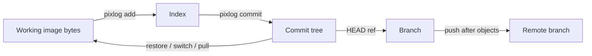

# Architecture

## Design Rule

PixLog does not treat an image as one hash. It separates:

- **Content identity**: SHA-256 of exact source bytes.
- **Manifest identity**: SHA-256 of normalized inspection data.
- **Recipe identity**: SHA-256 of normalized generation/edit JSON.
- **Commit identity**: SHA-256 of the immutable commit object.

This distinction prevents common false conclusions. JPEG recompression can
change nearly every byte while preserving appearance; metadata can change with
identical pixels; visually similar outputs can come from different workflows.

## Repository Layout

```text
.pixlog/
  HEAD
  config.json
  index.json
  objects/
    sha256/ab/cdef...
  refs/
    heads/
    remotes/
    tags/
  locks/
```

All content, manifests, recipes, and commits share one immutable object store.
The object type is established by the reference and validated when decoded.

## State Model



- `status` compares HEAD to index, then index to worktree.
- `diff` compares index to worktree by default.
- `diff --staged` and `check` compare HEAD to index.
- Commit trees map repository-relative paths to content, manifest, and recipe OIDs.

## Visual Diff Pipeline

The alpha pipeline is deterministic and local:

1. Decode both images through Go's registered image codecs.
2. Classify dimensions as identity, resize, possible crop/rotation/canvas extension.
3. Sample the new image dimensions, capped at 2048 pixels on the longest edge.
4. Compare NRGBA channels using a configurable threshold.
5. Calculate changed ratio, normalized RMSE, global SSIM, and mean channel delta.
6. Group changed pixels into four-connected regions and project bounding boxes to
   output coordinates.
7. Optionally encode the in-memory heatmap as PNG.

Visual bisect compares each changed historical version against a fixed baseline in
chronological order. It deliberately scans rather than assuming the metric is
monotonic, so a later revert does not hide the first threshold crossing.

Dimension classification is not registration. The engine does not yet estimate an
old-to-new transform, so translated/cropped images can over-report pixel changes.

## Provenance

Repository recipe objects are authoritative; embedded metadata is a portable copy.
On `add`, PNG metadata adapters can create a recipe object. Manual import replaces
the staged entry's recipe OID. Commit history therefore retains the exact recipe
reference associated with each image version.

`pixlog run` snapshots supported image OIDs before and after an explicitly supplied
child command. On exit status 0 it stores a command recipe and stages added/modified
outputs plus tracked deletions. On nonzero exit it leaves the index unchanged.
Environment variables are not captured, and arguments can be replaced with
`<redacted>` before recipe storage.

PixLog never claims that a recipe inferred from two flattened images is exact.
Future semantic summaries must carry an explicit `AI-inferred` label.

## Synchronization Invariants

For the current local filesystem transport, push performs:

1. Resolve the current local and remote branch tips.
2. Reject a non-fast-forward update.
3. Copy missing CAS objects.
4. Recompute and verify every copied SHA-256 digest.
5. Atomically update the remote branch ref last.

Pull fetches objects and a remote-tracking ref, rejects dirty or divergent state,
then atomically restores the fast-forward commit tree. Checkout validates paths to
prevent absolute paths and `..` traversal from escaping the repository.

## Locks

Each lock is a JSON record keyed by SHA-256 of the repository-relative asset path.
Acquisition uses `O_CREATE|O_EXCL`, giving one winner on filesystems that implement
exclusive creation atomically. Locks include owner, random token, timestamp, and
remote name. This is suitable for local and shared filesystem remotes; distributed
object-store locks will need conditional writes and lease semantics.

## Policy

`.pixlog-policy.json` is parsed strictly: unknown fields and invalid ranges fail.
Rules match repository paths and validate the staged snapshot. Visual policies use
the same HEAD-to-index diff as `pixlog diff --staged`, ensuring CI evaluates what
will actually be committed.

`allowed_change_mask` points to a repository-relative decodable image. The mask is
scaled to new-image coordinates: pixels with alpha and mean RGB at least 128 permit
changes; transparent or darker pixels deny them. The check reports exact outside
pixel counts and connected outside regions.

## Security and Integrity Boundaries

- SHA-256 is the exact object identity; perceptual hashes are search hints only.
- Object transfers are verified before refs move.
- Checkout paths are validated before filesystem writes.
- Recipe JSON is provenance data, not executable code.
- Remote URLs with unsupported schemes are rejected rather than shell-executed.
- C2PA signing and trust policy are not implemented yet.
