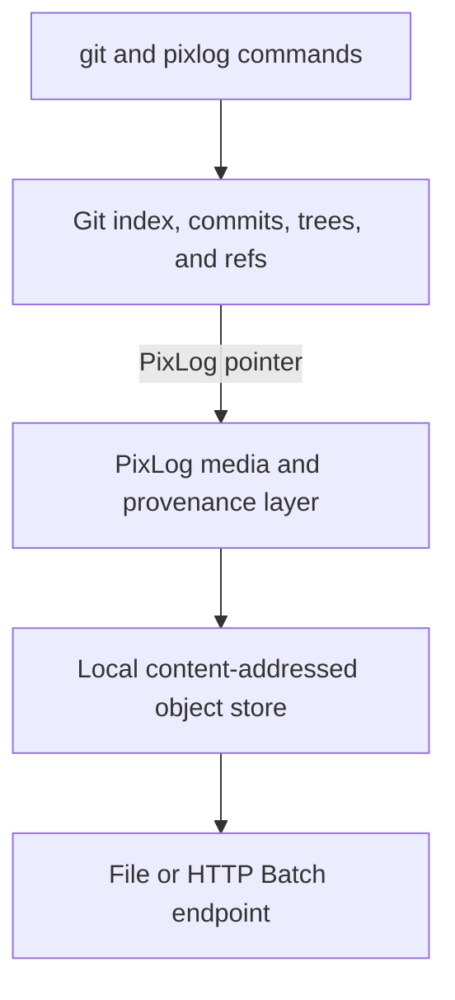

# Git Integration

This is the canonical design and implementation-status document for PixLog's Git
integration. Git is the only version-control engine. PixLog is a Git-compatible
porcelain, media filter, and content-addressed object layer for images and AI
provenance.

## Core Contract

PixLog follows three non-negotiable rules:

1. PixLog never creates a second commit graph or staging area for a Git worktree.
2. `pixlog add`, `commit`, `push`, and other Git-owned commands enter the
   corresponding Git operation.
3. Direct `git add`, `commit`, `checkout`, and `push` continue to invoke PixLog's
   filter and hook after repository installation.



## Ownership

| Git owns | PixLog owns |
| --- | --- |
| HEAD, commits, trees, branches, tags | Image pointers and exact-byte identities |
| Index, worktree rules, pathspecs, ignores | Blob, manifest, and recipe CAS objects |
| Merge, rebase, reset, bisect | Clean/smudge, visual diff, and safe PNG merge |
| Git remotes, credentials, signing, editors | Provenance journal and reproduction checks |
| Clone, fetch, pull, push | Media hydration, transfer, integrity, and locks |

The current CLI does not initialize or select `.pixlog/HEAD`, `.pixlog/index`,
PixLog refs, or PixLog commits. The old repository implementation remains in the
codebase for compatibility and future migration tooling, but is not the current
CLI ownership model.

## Entry Points And Routing

The build installs the same CLI through two executable names:

```text
pixlog
git-pixlog
```

When `git-pixlog` is on `PATH`, `git pixlog <command>` and
`pixlog <command>` reach the same implementation. `pixlog git <command>` is the
unmodified escape hatch for any Git command.

| User command | Effective behavior |
| --- | --- |
| `git add image.png` | Clean filter stores CAS objects and gives Git a pointer |
| `pixlog add image.png` | Associates optional provenance, then runs `git add` |
| `git commit ...` / `pixlog commit ...` | Git creates the commit |
| `git push ...` | Installed pre-push hook uploads referenced media first |
| `pixlog push ...` | Ensures the hook is installed, then runs `git push ...` |
| `git checkout` / `pixlog checkout` | Git checkout invokes the smudge filter |
| `pixlog clone ...` | Runs Git clone with the filter, installs PixLog, hydrates |
| `pixlog log/show/branch/tag/...` | Proxies Git with its arguments and exit code |
| `pixlog status --porcelain[=v2] -z` | Proxies Git's machine-readable bytes |
| `pixlog diff/status/inspect/...` | Runs PixLog's image-aware read model |

Git-owned routing includes `rm`, `commit`, `log`, `show`, `restore`, `checkout`,
`branch`, `switch`, `tag`, `remote`, `push`, `fetch`, `pull`, `clone`, `merge`,
`bisect`, `rebase`, `cherry-pick`, `reset`, and `revert`.

## Installation And Tracking

Initialize a new repository or install into an existing one:

```bash
pixlog init .
# Equivalent compatibility spelling:
pixlog init --git .

# Refresh an existing installation:
pixlog install
pixlog git install
```

Installation is idempotent and:

1. Maintains a marked block in `.gitattributes`.
2. Creates `.pixlog.toml` if it does not exist.
3. Configures the local filter, diff, difftool, and merge drivers.
4. Installs a local pre-push dispatcher without discarding an existing hook.

Commit `.gitattributes` and `.pixlog.toml`. Driver commands, the hook, CAS,
journal, credentials, and machine-specific settings remain under `.git/`.

The default tracking block covers PNG, JPEG, GIF, WebP, AVIF, HEIC, TIFF, and
PSD. Add repository-specific Git attribute patterns with:

```bash
pixlog track 'art/**/*.kra' 'renders/*.bmp'
```

Custom patterns survive later installs.

## Pointer And Object Model

Git stores a small, LFS-compatible text pointer instead of original image bytes:

```text
version https://git-lfs.github.com/spec/v1
oid sha256:<image-digest>
size 4821930
pixlog.manifest sha256:<manifest-digest>
pixlog.media image/png
pixlog.recipe sha256:<recipe-digest>
pixlog.visual phash:ab4982
```

`version`, `oid`, `size`, and `pixlog.manifest` are required. Recipe, media type,
and visual hash are optional. A pointer is canonical text no larger than 1024
bytes. Full prompts, workflows, masks, and model metadata stay in recipe objects,
not in the pointer.

```text
.git/
  pixlog/
    objects/sha256/<2-hex>/<remaining-hex>
    journal.sqlite
    locks/
.gitattributes
.pixlog.toml
```

The authoritative object types are:

| Type | Meaning |
| --- | --- |
| Blob | Original image bytes, restored bit-exactly |
| Manifest | Format, dimensions, metadata, size, and visual identity |
| Recipe | Normalized `pixlog.recipe/v1` generation provenance |

Previews, heatmaps, and other derived output are caches and are not required to
reconstruct an asset.

## Add And Checkout

The long-running Git `filter-process` v2 server advertises clean and smudge.


Clean performs the following operations:

1. Hashes and stores the original bytes.
2. Inspects and stores the normalized manifest.
3. Looks up a recipe in the provenance journal or embedded metadata.
4. Emits a pointer containing the authoritative object references.

Smudge verifies the pointer, loads the local object or fetches it from `origin`,
checks its SHA-256 and size, and writes the original bytes. Existing raw image
blobs remain readable for repositories created before pointer storage.

## Provenance Journal

`.git/pixlog/journal.sqlite` maps an output content OID to its recipe OID. It is
local state and is never committed. `pixlog run`, recipe import, and other capture
paths record the association before `git add`; the clean filter can therefore
attach the same recipe whether the user stages with Git or PixLog.

`pixlog run -- <command>` records changed image outputs only after a successful
command. The recipe includes the pre-run Git HEAD, index tree, branch hint, and
dirty state. `--redact-args` stores placeholders for sensitive arguments.

## Push, Remote Transfer, And Hydration

The local pre-push dispatcher first runs any preserved user hook. It then reads
Git's ref updates, scans newly reachable commits for PixLog pointers, and uploads
their blobs, manifests, and recipes before allowing Git to push refs.

Supported media endpoints are:

- Local paths and `file://` endpoints.
- HTTP(S) LFS-style Batch clients with basic upload, download, and verify actions.

Configure an endpoint per Git remote:

```bash
git config pixlog.remote.origin.endpoint /srv/pixlog/project-media
git config pixlog.remote.origin.endpoint https://media.example.test/project
```

For local Git remotes, `endpoint = "auto"` derives a sibling `.pixlog` path.
Network Git remotes require an explicit media endpoint.

Git refs and PixLog media live in separate systems, so push is ordered rather
than transactionally atomic. CAS uploads are idempotent; an upload failure blocks
the Git push, while a later Git failure may leave harmless unreferenced objects.

Explicit worktree controls are available:

```bash
pixlog dehydrate assets/hero.png
pixlog hydrate assets/hero.png
```

Clone installs the repository-local integration and hydrates through the same
smudge and remote path. Delayed checkout, preview-only clone, direct S3/Azure
adapters, and an HTTP lock protocol are not implemented.

## Visual History And Merge

PixLog follows Git snapshot semantics:

| Command | From | To |
| --- | --- | --- |
| `pixlog diff` | Git index | Worktree |
| `pixlog diff --staged` | Git HEAD | Git index |
| `pixlog diff A B` | Git revision A | Git revision B |
| `pixlog check` | Git HEAD | Git index |
| `pixlog check --range A..B` | Git revision A | Git revision B |
| `pixlog check --range A...B` | Merge base of A/B | Git revision B |

`git diff` uses a deterministic text driver. `git difftool --tool=pixlog` invokes
the direct image comparison command. PixLog reports byte and manifest changes,
pixel metrics, SSIM, geometry classification, and changed regions for supported
raster formats.

The merge driver is conservative. It automatically combines same-size PNG edits
only when changed pixels do not conflict. Overlapping edits, geometry changes,
and unsupported formats return nonzero so Git keeps the path conflicted.

`pixlog lineage` follows Git history across renames. `pixlog blame --point x,y`
attributes a changed pixel region. These operate on the Git DAG but currently use
first-parent attribution for merge commits rather than a full provenance DAG.

## Reproduction, Integrity, And Locks

`pixlog reproduce` creates a plan from a historical recipe. Execution is allowed
only for an unredacted captured command whose recorded clean HEAD and index tree
match the current repository state. Provider-specific generation adapters still
require their own executors.

`pixlog verify` checks local CAS hashes and objects referenced by staged pointers.
`pixlog doctor` also checks filter, attributes, diff, merge, hook, config, and
object integrity.

Locks are available locally and through shared file endpoints. Acquisition is
atomic and release is owner-checked. HTTP locks require a future lock service.

## Backward Compatibility And Security

- Raw image Git blobs and legacy `.pixlog-meta` sidecars remain readable.
- New writes use pointers, `.pixlog.toml`, the local CAS, and the journal; they do
  not create new sidecars.
- Recipe content is data, never shell code. Reproduction validates paths, source
  state, and redaction before execution.
- Tokens and machine configuration belong in Git config or a credential store,
  not `.pixlog.toml` or a pointer.
- The traditional hook fallback preserves an existing pre-push hook. Global named
  hook registration is not implemented.

## Phase Status

| Phase | Status | Implemented | Remaining |
| --- | --- | --- | --- |
| Phase 1: Git-compatible core | **Done** | Pointer/CAS, filter-process, install/track, Git-only routing, add/status/commit, checkout round trip | No Phase 1 blocker |
| Phase 2: Remote | **Partial** | Preserving pre-push hook, file endpoint, HTTP Batch client, fetch-on-smudge, hydrate/dehydrate, clone hydration | Direct S3/Azure adapters, delayed/preview clone, hosted endpoint |
| Phase 3: Visual experience | **Partial** | PixLog diff, Git diff/difftool, metadata/pixel metrics, conservative PNG merge | Local Web UI, semantic diff, broader registration and merge formats |
| Phase 4: AI provenance | **Partial** | SQLite journal, embedded ComfyUI/A1111 import, run capture, recipe diff, guarded reproduce, Git lineage | API proxy/SDK, provider executors, reference DAG |
| Phase 5: Collaboration | **Partial** | Local/file locks, doctor/verify, safe non-overlap PNG merge, visual blame | HTTP locks, server validation, GitHub Checks, review UI |

Detailed feature-level evidence is maintained in
[FEATURE_PROGRESS.md](FEATURE_PROGRESS.md).